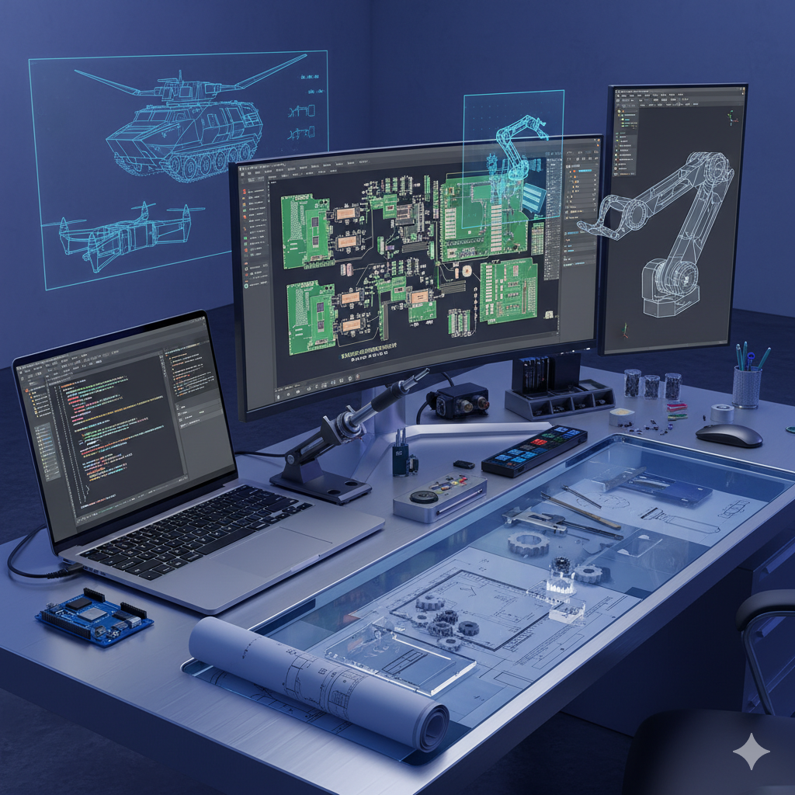

  

<h1 align="center">👋 Hello, I'm <b>Ibrahim Mutua</b></h1>

  A multidisciplinary <strong>Software Developer</strong>, <strong>Mechanical Engineer</strong>, 
  <strong>IoT Engineer</strong>, and <strong>PCB Designer</strong> from Kenya. 
  I specialize in creating solutions that seamlessly integrate <strong>software and hardware</strong> — 
  from full-stack web applications and embedded systems to 3D simulations and custom PCB designs.  
  I’m driven by a deep fascination with <strong>military technology</strong>, autonomous systems, 
  and cutting-edge engineering innovations.

------------------------------------------------------------------------

## 🚀 What I Do

-   🧑‍💻 **Full‑Stack Developer (MERN Stack)**
-   🛠 **PCB Designer** (KiCad / EasyEDA)
-   🤖 **IoT & Embedded Systems Developer**
-   🔧 **Mechanical Engineering Projects & Prototyping**
-   🎮 **3D & Game Development** using Blender and Unity
-   🎯 Strong interest in **military tech**, robotics & defense systems

------------------------------------------------------------------------
## 🧠 Currently Learning
- Deepening knowledge in **embedded systems & IoT**
- Improving **React Native** and mobile development
- Exploring **AI & ML tools**
- Advancing 3D design and engineering modeling in **SolidWorks**

## 🛠️ Tech Stack & Tools
---
### **Programming Languages**

------------------------------------------------------------------------

### **Frontend**

------------------------------------------------------------------------

### **Backend**

------------------------------------------------------------------------

### **Databases**

------------------------------------------------------------------------

### **Tools, Platforms & Design**

------------------------------------------------------------------------

## 📫 Contact Me

-   **GitHub:** https://github.com/ibrahimmutua\
-   **Email:** ibrahimmutua315@gmail.com

------------------------------------------------------------------------

✨ *Thanks for stopping by --- let's build something impactful!*
